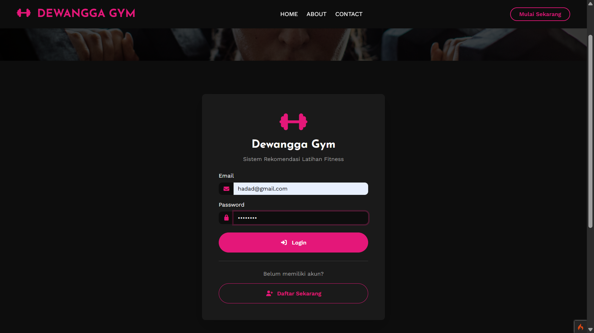
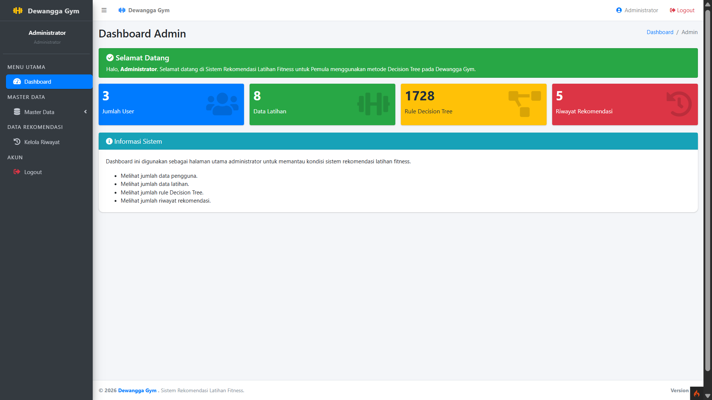
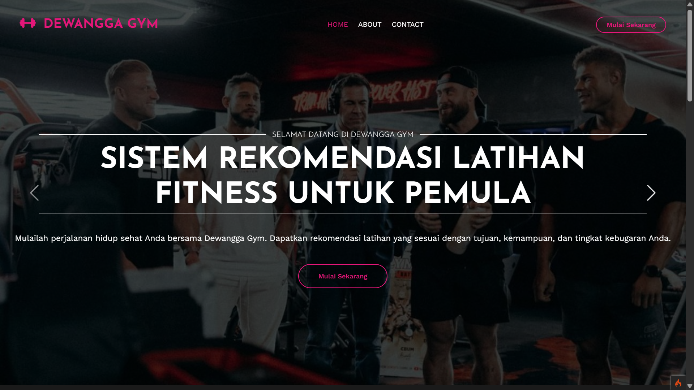
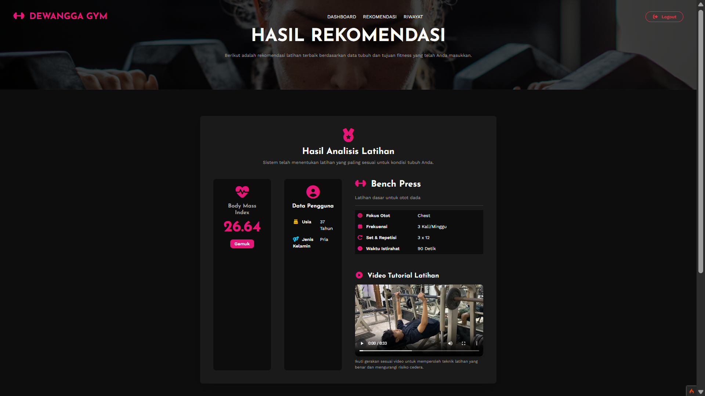

# 🏋️ Sistem Rekomendasi Latihan Fitness Dewangga Gym

Sistem rekomendasi latihan fitness berbasis web yang dikembangkan untuk membantu pengguna, khususnya pemula, mendapatkan rekomendasi latihan berdasarkan kondisi dan tujuan latihan.

## 📌 Tentang Project

Project ini merupakan tugas akhir pada Program Studi Sistem Informasi.

Sistem menggunakan metode **Decision Tree** untuk menentukan rekomendasi latihan berdasarkan beberapa faktor pengguna.

### Faktor yang digunakan

* Usia
* Jenis kelamin
* Kategori BMI
* Tujuan latihan
* Riwayat cedera
* Tingkat kebugaran
* Kelompok otot

## ✨ Fitur

* 🔐 Login dan autentikasi
* 👤 Pengelolaan data pengguna
* 📊 Perhitungan BMI
* 🧠 Rekomendasi latihan menggunakan Decision Tree
* 💪 Pemilihan kelompok otot
* 🔢 Informasi set dan repetisi
* ⏱️ Waktu istirahat
* 🎥 Video tutorial latihan
* ⚙️ Dashboard admin

## 🛠️ Teknologi

* PHP
* CodeIgniter 4
* MySQL
* HTML
* CSS
* JavaScript

## 🧠 Metode

Metode **Decision Tree** digunakan untuk membentuk aturan rekomendasi latihan berdasarkan karakteristik dan kondisi pengguna.

## 🔄 Metode Pengembangan

Pengembangan sistem menggunakan model **Waterfall** yang terdiri dari:

1. Analisis kebutuhan
2. Perancangan sistem
3. Pengkodean
4. Pengujian
5. Pemeliharaan

## 🖥️ Tampilan Sistem

### Halaman Login

### Dashboard

### Halaman utama

### Hasil Rekomendasi

## 🧪 Pengujian

Pengujian sistem dilakukan menggunakan:

* Black Box Testing
* User Acceptance Test (UAT)

## 📚 Status Project

Project ini dikembangkan sebagai project tugas akhir dan dapat dikembangkan lebih lanjut untuk meningkatkan fitur serta pengalaman pengguna.

## 👨‍💻 Author

**Bintang Hadad Noval**

Information Systems

---

⭐ Project ini dibuat sebagai bagian dari pengembangan kemampuan dalam web development dan sistem informasi.
use the HTTP\CURLRequest library
